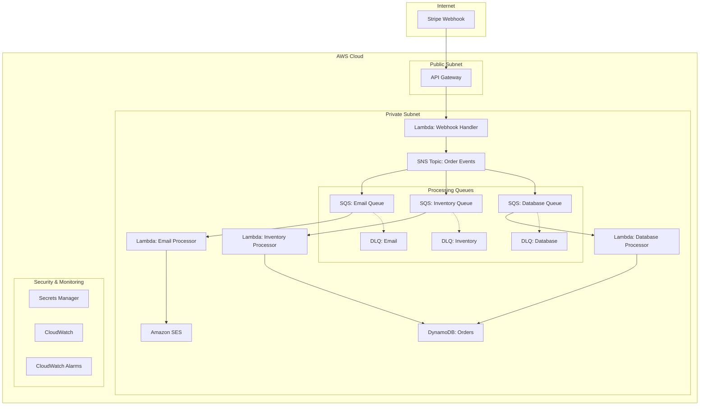

# Stripe Order Processing System

## 🏗️ Kiến trúc hệ thống



## 🚀 Triển khai nhanh

### Prerequisites

1. **AWS CLI configured:**
```bash
aws configure --profile my-stripe-system-dev
```

2. **Terraform >= 1.3.9**
3. **Python 3.9+**
4. **Make installed**

### Bước triển khai

1. **Clone repository:**
```bash
git clone <repo-url>
cd my-stripe-system
```

2. **Tạo S3 bucket và DynamoDB cho Terraform state:**
```bash
cd aws
./pre-build.sh
# Nhập: my-stripe-system, dev, ap-northeast-1
```

3. **Symlink variables files:**
```bash
cd terraform/envs/dev
make symlink_all e=dev
```

4. **Deploy infrastructure:**
```bash
# Deploy general infrastructure (VPC, IAM)
make init e=dev s=1.general
make apply e=dev s=1.general

# Deploy order processing system
make init e=dev s=3.order-processing  
make apply e=dev s=3.order-processing
```

5. **Cấu hình Stripe webhook:**
```bash
# Lấy webhook endpoint URL
cd terraform/envs/dev/3.order-processing
terraform output webhook_endpoint_url
```

Vào Stripe Dashboard → Webhooks → Tạo webhook với URL trên và chọn events:
- `payment_intent.succeeded`
- `checkout.session.completed`

6. **Cập nhật Secrets trong AWS:**
```bash
# Cập nhật Stripe webhook secret
aws secretsmanager put-secret-value \
    --secret-id my-stripe-system-dev-stripe-webhook-secret \
    --secret-string '{"webhook_secret":"whsec_your_real_secret","api_key":"sk_test_your_api_key"}'

# Cấu hình SES email
aws secretsmanager put-secret-value \
    --secret-id my-stripe-system-dev-email-config \
    --secret-string '{"from_email":"noreply@yourdomain.com","support_email":"support@yourdomain.com"}'
```

## 📊 Monitoring & Observability

### CloudWatch Dashboard
Truy cập: `https://ap-northeast-1.console.aws.amazon.com/cloudwatch/home#dashboards:`

### Key Metrics được giám sát:
- **SQS Queue Depth**: Số lượng message đang chờ xử lý
- **Dead Letter Queue**: Cảnh báo khi có message failed
- **Lambda Errors**: Lỗi trong các Lambda functions
- **Lambda Duration**: Thời gian xử lý của từng function
- **API Gateway**: Response time và error rates

### Alarms được cấu hình:
- Email DLQ có message → Alert
- Inventory DLQ có message → Alert  
- Database DLQ có message → Alert
- Lambda function errors > 5 trong 5 phút → Alert
- SQS Queue depth > threshold → Alert

## 🔒 Security Features

### Network Security
- **VPC**: Tất cả Lambda functions trong private subnets
- **Security Groups**: Chỉ cho phép HTTPS outbound traffic
- **NAT Gateway**: Cho Lambda functions truy cập internet

### IAM Security
- **Least Privilege**: Mỗi Lambda chỉ có quyền tối thiểu cần thiết
- **Role Separation**: Mỗi function có IAM role riêng biệt
- **Resource-based policies**: SQS và SNS có policies hạn chế

### Data Security
- **Secrets Manager**: Lưu trữ API keys và sensitive data
- **Webhook Verification**: Xác thực Stripe signature
- **DynamoDB Encryption**: Data at rest được mã hóa
- **CloudWatch Logs**: Không log sensitive information

## 🛠️ Development & Testing

### Local Testing
```bash
# Test Lambda functions locally
cd aws/lambda-functions/webhook-handler
python -m pytest tests/

# Test Terraform configs
cd aws/terraform/envs/dev/3.order-processing
terraform plan -var-file=../terraform.dev.tfvars
```

### CI/CD Pipeline
GitHub Actions tự động:
1. **Security Scan**: Trivy vulnerability scanning
2. **Terraform Plan**: Review infrastructure changes
3. **Build**: Package Lambda functions
4. **Deploy**: Apply Terraform configs
5. **Validate**: Verify deployment success

### Troubleshooting Common Issues

**1. Lambda timeout errors:**
```bash
# Check CloudWatch logs
aws logs describe-log-groups --log-group-name-prefix="/aws/lambda/my-stripe-system"
aws logs tail /aws/lambda/my-stripe-system-dev-webhook-handler --follow
```

**2. DLQ messages:**
```bash
# Check DLQ contents
aws sqs get-queue-attributes --queue-url <dlq-url> --attribute-names All
aws sqs receive-message --queue-url <dlq-url>
```

**3. Webhook verification failed:**
```bash
# Verify Stripe signature in CloudWatch logs
# Check webhook secret in Secrets Manager
aws secretsmanager get-secret-value --secret-id my-stripe-system-dev-stripe-webhook-secret
```

## 📈 Scaling & Performance

### Auto Scaling
- **Lambda**: Tự động scale theo concurrent executions
- **DynamoDB**: On-demand billing, auto-scale read/write capacity
- **SQS**: Unlimited throughput, tự động scale

### Performance Optimization
- **Lambda Cold Start**: Sử dụng provisioned concurrency cho critical functions
- **DynamoDB**: Global Secondary Indexes cho query performance
- **SQS Batching**: Process multiple messages per invocation

### Cost Optimization
- **Lambda**: Optimized memory allocation cho từng function
- **DynamoDB**: On-demand pricing cho unpredictable workloads
- **CloudWatch**: Retention policy 14 days cho logs

## 🔄 Disaster Recovery

### Backup Strategy
- **DynamoDB**: Point-in-time recovery enabled
- **Terraform State**: Stored in S3 với versioning
- **Lambda Code**: Stored in Git repository

### Recovery Procedures
```bash
# Restore từ backup
aws dynamodb restore-table-from-backup \
    --target-table-name my-stripe-system-dev-orders-restored \
    --backup-arn <backup-arn>

# Redeploy infrastructure
terraform apply -var-file=../terraform.dev.tfvars
```

## 🧪 Testing Strategy

### Unit Tests
```bash
cd aws/lambda-functions/webhook-handler
python -m pytest tests/ -v
```

### Integration Tests
```bash
# Test end-to-end flow
curl -X POST $WEBHOOK_URL \
  -H "Stripe-Signature: $STRIPE_SIGNATURE" \
  -d @test-payload.json
```

### Load Testing
```bash
# Sử dụng artillery.js hoặc similar tools
artillery run load-test-config.yml
```

## 📚 API Documentation

### Webhook Endpoint
```
POST /dev/webhook
Content-Type: application/json
Stripe-Signature: t=<timestamp>,v1=<signature>
```

**Request Body**: Stripe webhook payload
**Response**: 
- `200`: Success
- `400`: Invalid request
- `401`: Invalid signature
- `500`: Internal error

## 📧 Support & Maintenance

### Monitoring Checklist
- [ ] CloudWatch alarms functioning
- [ ] DLQ messages = 0
- [ ] Lambda error rates < 1%
- [ ] API Gateway response time < 2s
- [ ] DynamoDB throttling = 0

### Regular Maintenance
- **Weekly**: Review CloudWatch metrics
- **Monthly**: Update Lambda runtimes
- **Quarterly**: Security review và dependency updates

### Contact Information
- **DevOps Team**: devops@company.com
- **On-call**: Slack #ops-alerts
- **Documentation**: Internal Wiki

---

## 📝 Changelog

### v1.0.0 (2024-01-XX)
- Initial release
- Stripe webhook processing
- Email notifications
- Inventory management
- Database operations
- Monitoring & alerting

---

**Made with ❤️ by DevOps Team**
