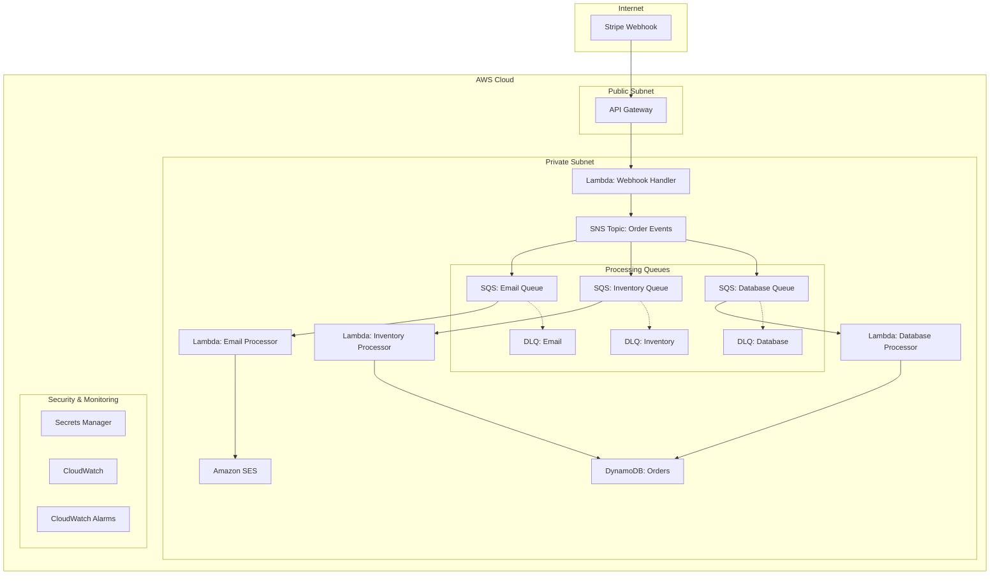

# Stripe Order Processing System

> **Serverless order processing system với AWS Lambda, SNS, SQS và DynamoDB**

[](https://www.terraform.io/)
[](https://aws.amazon.com/)
[](https://www.python.org/)
[](LICENSE)

---

## 📋 Mục lục

- [Kiến trúc hệ thống](#-kiến-trúc-hệ-thống)
- [Thành phần chính](#-thành-phần-chính)
- [Yêu cầu hệ thống](#-yêu-cầu-hệ-thống)
- [Hướng dẫn triển khai](#-hướng-dẫn-triển-khai)
- [Cấu hình](#-cấu-hình)
- [Giám sát & Vận hành](#-giám-sát--vận-hành)
- [Bảo mật](#-bảo-mật)
- [Development](#-development)
- [Troubleshooting](#-troubleshooting)
- [FAQ](#-faq)

---

## 🏗️ Kiến trúc hệ thống



### Luồng xử lý (Processing Flow)

1. **Webhook Reception** (< 1s)
   - Stripe gửi webhook event đến API Gateway
   - API Gateway trigger Lambda webhook-handler
   - Lambda verify Stripe signature
   - Lambda lưu initial order vào DynamoDB
   - Lambda publish event đến SNS topic

2. **Event Distribution** (< 2s)
   - SNS fanout message đến 3 SQS queues
   - Mỗi queue có filter policy riêng
   - Messages được batch theo cấu hình

3. **Parallel Processing** (5-120s)
   - **Email Processor**: Gửi order confirmation qua SES
   - **Inventory Processor**: Allocate/deallocate inventory
   - **Database Processor**: Update order status & records

4. **Error Handling**
   - Failed messages → Dead Letter Queues
   - CloudWatch Alarms trigger khi có messages trong DLQ
   - SNS alerts gửi notification đến team

---

## 🧩 Thành phần chính

### Lambda Functions

| Function | Runtime | Description |
|----------|---------|---------|
| **webhook-handler** | Python 3.9 | Nhận webhook từ Stripe, verify signature, publish SNS |
| **email-processor** | Python 3.9 | Xử lý gửi email confirmation qua SES |
| **inventory-processor** | Python 3.9 | Quản lý inventory allocation/deallocation |
| **database-processor** | Python 3.9 | Update order records & processing logs |

### Message Queues

| Queue | DLQ |
|-------|-----|
| **email-queue** | email-dlq |
| **inventory-queue** | inventory-dlq |
| **database-queue** | database-dlq |

### DynamoDB Tables

| Table | Partition Key | Sort Key | GSI | Capacity Mode | TTL |
|-------|--------------|----------|-----|---------------|-----|
| **orders** | order_id | - | status-index | On-demand | - |
| **processing-logs** | log_id | - | order_id-index | On-demand | 30 days |

### Secrets Manager

| Secret | Purpose | Rotation |
|--------|---------|----------|
| **stripe-webhook-secret** | Stripe webhook signature verification | Manual |
| **email-config** | SES email configuration | Manual |

---

## ✅ Yêu cầu hệ thống

### Local Development

- **Terraform**: >= 1.3.9
- **AWS CLI**: >= 2.x
- **Python**: 3.9+
- **Make**: GNU Make
- **jq**: JSON processor (for scripts)

### AWS Resources

- **AWS Account** với appropriate permissions
- **AWS Profile** configured: `myproject-dev`
- **S3 Bucket** cho Terraform state: `myproject-dev-iac-state`
- **DynamoDB Table** cho state lock: `myproject-dev-terraform-state-lock`
- **KMS Key** cho encryption (optional)

### AWS Services Quotas

Đảm bảo account có đủ quotas:

- Lambda concurrent executions: >= 300
- SQS queues: >= 10
- SNS topics: >= 5
- DynamoDB tables: >= 5
- CloudWatch log groups: >= 10
- Secrets Manager secrets: >= 5

---

## 🚀 Hướng dẫn triển khai

### Bước 1: Chuẩn bị môi trường

```bash
# Clone repository
git clone <repository-url>
cd my-stripe-system

# Configure AWS Profile
aws configure --profile myproject-dev
# AWS Access Key ID: [Your Access Key]
# AWS Secret Access Key: [Your Secret Key]
# Default region name: ap-northeast-1
# Default output format: json
```

### Bước 2: Tạo Backend Resources

```bash
# Chạy pre-build script để tạo S3 bucket và DynamoDB table
cd aws
./pre-build.sh

# Nhập thông tin khi được hỏi:
# Project Name: myproject
# Environment: dev
# Region: ap-northeast-1

# Verify resources đã được tạo
aws s3 ls | grep myproject-dev-iac-state
aws dynamodb list-tables | grep myproject-dev-terraform-state-lock
```

### Bước 3: Symlink Variables

```bash
# Di chuyển đến terraform directory
cd terraform/envs/dev

# Tạo symlinks cho tất cả services
make symlink_all e=dev

# Verify symlinks
ls -la 1.general/_variables.tf
ls -la 3.order-processing/_variables.tf
```

### Bước 4: Review Terraform Configuration

```bash
# Kiểm tra variables
cat terraform.dev.tfvars

# Expected content:
# project = "myproject"
# env     = "dev"
# region  = "ap-northeast-1"

# Review backend configuration
cat 3.order-processing/_backend.tf
```

### Bước 5: Deploy General Infrastructure

```bash
# Initialize Terraform
make init e=dev s=1.general

# Review plan
make plan e=dev s=1.general

# Apply infrastructure
make apply e=dev s=1.general

# Expected outputs:
# - VPC ID
# - IAM roles
# - Security groups
```

### Bước 6: Build Lambda Functions

```bash
# Quay về root directory
cd ../../../..

# Build Lambda packages locally (optional)
cd aws/terraform-dependencies/lambda-function

# Build từng function
for func in webhook-handler email-processor inventory-processor database-processor; do
  cd $func
  if [ -f requirements.txt ]; then
    pip install -r requirements.txt -t .
  fi
  zip -r ../${func}.zip . -x "*.pyc" "__pycache__/*" "tests/*"
  cd ..
done

# Hoặc sử dụng GitHub Actions để build (recommended)
```

### Bước 7: Deploy Order Processing Service

```bash
# Copy Lambda packages đến service directory
cd ../terraform/envs/dev/3.order-processing
cp ../../../../terraform-dependencies/lambda-function/*.zip ./

# Initialize Terraform
make init e=dev s=3.order-processing

# Review plan
make plan e=dev s=3.order-processing

# Apply infrastructure
make apply e=dev s=3.order-processing

# Capture outputs
terraform output > deployment-outputs.txt
```

### Bước 8: Lấy Webhook URL

```bash
# Lấy webhook endpoint URL
cd aws/terraform/envs/dev/3.order-processing
terraform output -raw webhook_endpoint_url

# Example output:
# https://abc123xyz.execute-api.ap-northeast-1.amazonaws.com/webhook

# Save URL này để configure trong Stripe Dashboard
```

### Bước 9: Configure Stripe Webhook

1. **Truy cập Stripe Dashboard**
   - URL: https://dashboard.stripe.com/webhooks
   - Login với Stripe account

2. **Tạo Webhook Endpoint**
   - Click "Add endpoint"
   - Paste webhook URL từ bước 8
   - Select events:
     - ✅ `checkout.session.completed`
     - ✅ `payment_intent.succeeded`
   - Click "Add endpoint"

3. **Lấy Webhook Signing Secret**
   - Sau khi tạo endpoint, click vào endpoint
   - Copy "Signing secret" (bắt đầu với `whsec_...`)

### Bước 10: Update Secrets

```bash
# Update Stripe webhook secret
aws secretsmanager put-secret-value \
    --secret-id myproject-dev-stripe-webhook-secret \
    --secret-string '{
      "webhook_secret": "whsec_your_actual_secret_from_stripe",
      "api_key": "sk_test_your_stripe_api_key"
    }' \
    --profile myproject-dev \
    --region ap-northeast-1

# Update email configuration
aws secretsmanager put-secret-value \
    --secret-id myproject-dev-email-config \
    --secret-string '{
      "from_email": "noreply@myproject.com",
      "support_email": "support@myproject.com"
    }' \
    --profile myproject-dev \
    --region ap-northeast-1

# Verify secrets
aws secretsmanager get-secret-value \
    --secret-id myproject-dev-stripe-webhook-secret \
    --query SecretString \
    --output text \
    --profile myproject-dev
```

### Bước 11: Verify SES Email Identity

```bash
# Nếu sử dụng email cụ thể (sandbox mode)
aws ses verify-email-identity \
    --email-address noreply@myproject.com \
    --profile myproject-dev \
    --region ap-northeast-1

# Check verification status
aws ses get-identity-verification-attributes \
    --identities noreply@myproject.com \
    --profile myproject-dev \
    --region ap-northeast-1

# Nếu sử dụng domain (production)
aws ses verify-domain-identity \
    --domain myproject.com \
    --profile myproject-dev \
    --region ap-northeast-1
```

### Bước 12: Test Deployment

```bash
# Test với Stripe CLI
stripe listen --forward-to $(terraform output -raw webhook_endpoint_url)
stripe trigger checkout.session.completed

# Hoặc test trực tiếp
curl -X POST $(terraform output -raw webhook_endpoint_url) \
  -H "Content-Type: application/json" \
  -H "Stripe-Signature: t=test,v1=test_signature" \
  -d '{"type": "checkout.session.completed", "data": {...}}'

# Check CloudWatch Logs
aws logs tail /aws/lambda/myproject-dev-webhook-handler \
    --follow \
    --profile myproject-dev
```

---

## ⚙️ Cấu hình

### Environment Variables

Các environment variables được config trong Terraform và passed vào Lambda:

#### Webhook Handler
```bash
SNS_TOPIC_ARN              # ARN của SNS topic order-events
STRIPE_WEBHOOK_SECRET      # Name của secret trong Secrets Manager
ORDERS_TABLE              # Tên DynamoDB orders table
PROCESSING_LOGS_TABLE     # Tên DynamoDB logs table
```

#### Email Processor
```bash
PROCESSING_LOGS_TABLE     # Tên DynamoDB logs table
FROM_EMAIL               # Email sender address (SES verified)
EMAIL_CONFIG_SECRET      # Name của email config secret (optional)
```

#### Inventory Processor
```bash
ORDERS_TABLE             # Tên DynamoDB orders table
PROCESSING_LOGS_TABLE    # Tên DynamoDB logs table
```

#### Database Processor
```bash
ORDERS_TABLE             # Tên DynamoDB orders table
PROCESSING_LOGS_TABLE    # Tên DynamoDB logs table
```

### Terraform Variables

File: [`terraform.dev.tfvars`](aws/terraform/envs/dev/terraform.dev.tfvars)

```hcl
project = "myproject"     # Project name prefix
env     = "dev"           # Environment name
region  = "ap-northeast-1" # AWS region
```

### SNS Filter Policies

**Email Queue Filter:**
```json
{
  "event_type": ["order_completed"]
}
```

**Inventory Queue Filter:**
```json
{
  "event_type": ["order_completed", "order_cancelled"]
}
```

**Database Queue Filter:**
```json
{
  "event_type": ["order_completed", "order_failed", "order_processing"]
}
```

---

## 📊 Giám sát & Vận hành

### CloudWatch Dashboard

**Access URL:**
```
https://ap-northeast-1.console.aws.amazon.com/cloudwatch/home?region=ap-northeast-1#dashboards:name=myproject-dev-order-processing
```

**Widgets bao gồm:**

1. **SQS Queue Metrics** (12x6)
   - ApproximateNumberOfMessagesVisible
   - ApproximateAgeOfOldestMessage
   - NumberOfMessagesSent
   - NumberOfMessagesDeleted

2. **Lambda Duration** (12x6)
   - Average execution time
   - P50, P95, P99 latencies
   - Timeout occurrences

3. **Lambda Errors** (12x6)
   - Error count by function
   - Error rate percentage
   - Throttles

4. **DLQ Messages** (12x6)
   - Messages in each DLQ
   - Age of messages
   - Alert thresholds

5. **DynamoDB Metrics** (12x6)
   - ConsumedReadCapacityUnits
   - ConsumedWriteCapacityUnits
   - ThrottledRequests

### CloudWatch Alarms

| Alarm | Metric | Threshold | Actions |
|-------|--------|-----------|---------|
| **Email DLQ Messages** | ApproximateNumberOfMessagesVisible | > 0 | SNS → Email |
| **Inventory DLQ Messages** | ApproximateNumberOfMessagesVisible | > 0 | SNS → Email |
| **Database DLQ Messages** | ApproximateNumberOfMessagesVisible | > 0 | SNS → Email |
| **Webhook Handler Errors** | Errors | > 5 in 5 min | SNS → Email |
| **Email Queue Depth** | ApproximateNumberOfMessagesVisible | > 1000 | SNS → Email |
| **Lambda Duration** | Duration | > 25s (webhook) | SNS → Email |

### Logging Strategy

**Log Retention:**
- All Lambda functions: 14 days
- API Gateway access logs: 7 days
- CloudWatch metrics: 15 months (standard)

**Log Groups:**
```
/aws/lambda/myproject-dev-webhook-handler
/aws/lambda/myproject-dev-email-processor
/aws/lambda/myproject-dev-inventory-processor
/aws/lambda/myproject-dev-database-processor
/aws/apigateway/myproject-dev-webhook-api
```

**Log Format:**
```json
{
  "timestamp": "ISO-8601",
  "level": "INFO|WARN|ERROR",
  "function": "webhook-handler",
  "order_id": "evt_xxx",
  "message": "Processing completed",
  "duration_ms": 1234,
  "details": {}
}
```

### Useful AWS CLI Commands

```bash
# Check Lambda function status
aws lambda get-function \
    --function-name myproject-dev-webhook-handler \
    --profile myproject-dev \
    --region ap-northeast-1

# View recent CloudWatch logs
aws logs tail /aws/lambda/myproject-dev-webhook-handler \
    --since 1h \
    --follow \
    --profile myproject-dev

# Get DLQ message count
aws sqs get-queue-attributes \
    --queue-url $(terraform output -raw email_queue_url) \
    --attribute-names ApproximateNumberOfMessages \
    --profile myproject-dev

# List failed invocations
aws lambda list-function-event-invoke-configs \
    --function-name myproject-dev-webhook-handler \
    --profile myproject-dev

# Get DynamoDB table metrics
aws cloudwatch get-metric-statistics \
    --namespace AWS/DynamoDB \
    --metric-name ConsumedReadCapacityUnits \
    --dimensions Name=TableName,Value=myproject-dev-orders \
    --start-time 2024-01-01T00:00:00Z \
    --end-time 2024-01-01T23:59:59Z \
    --period 3600 \
    --statistics Average \
    --profile myproject-dev
```

---

## 🔒 Bảo mật

### Network Security

- ✅ **VPC Isolation**: Lambda functions trong private subnets
- ✅ **Security Groups**: Chỉ outbound HTTPS (443)
- ✅ **NAT Gateway**: Lambda access internet qua NAT
- ✅ **No Public IPs**: Không có Lambda nào có public IP
- ✅ **API Gateway**: Public endpoint với signature verification

### IAM Security

**Principle of Least Privilege Applied:**

1. **Webhook Handler Role**
   - `sns:Publish` → order-events topic only
   - `dynamodb:PutItem` → orders table only
   - `secretsmanager:GetSecretValue` → stripe secret only
   - `logs:CreateLogGroup`, `logs:CreateLogStream`, `logs:PutLogEvents`

2. **Email Processor Role**
   - `sqs:ReceiveMessage`, `sqs:DeleteMessage` → email-queue only
   - `ses:SendEmail` → verified identities only
   - `dynamodb:PutItem` → logs table only
   - `secretsmanager:GetSecretValue` → email-config only

3. **Inventory Processor Role**
   - `sqs:ReceiveMessage`, `sqs:DeleteMessage` → inventory-queue only
   - `dynamodb:UpdateItem` → orders table only
   - `dynamodb:PutItem` → logs table only

4. **Database Processor Role**
   - `sqs:ReceiveMessage`, `sqs:DeleteMessage` → database-queue only
   - `dynamodb:PutItem`, `dynamodb:UpdateItem` → both tables

**Resource Policies:**
- SNS topic chỉ allow publish từ webhook-handler
- SQS queues chỉ allow receive từ designated Lambda
- DynamoDB tables enable point-in-time recovery

### Data Security

- ✅ **Encryption at Rest**:
  - DynamoDB: AWS managed keys
  - S3 (tfstate): KMS encryption
  - Secrets Manager: AWS managed keys
  - CloudWatch Logs: Encrypted

- ✅ **Encryption in Transit**:
  - All communications use TLS 1.2+
  - API Gateway enforces HTTPS
  - Lambda VPC endpoints use AWS PrivateLink

- ✅ **Secret Management**:
  - No hardcoded credentials
  - Secrets Manager with automatic rotation support
  - IAM role-based access only

- ✅ **Webhook Verification**:
  - HMAC SHA-256 signature validation
  - Timestamp validation (prevent replay attacks)
  - IP whitelist support (optional)

### Compliance Checklist

- [ ] All Lambda functions use latest runtime
- [ ] Secrets rotation policy configured
- [ ] CloudWatch alarms all functional
- [ ] DLQ monitoring enabled
- [ ] Backup strategy documented
- [ ] Disaster recovery tested
- [ ] Access logs enabled for API Gateway
- [ ] VPC flow logs enabled
- [ ] IAM password policy enforced
- [ ] MFA enabled for AWS Console

---

## 💻 Development

### Local Development Setup

```bash
# 1. Clone repository
git clone <repo-url>
cd my-stripe-system

# 2. Install Python dependencies
cd aws/terraform-dependencies/lambda-function/webhook-handler
python3 -m venv venv
source venv/bin/activate
pip install -r requirements.txt

# 3. Deactivate venv
deactivate
```


### CI/CD Pipeline

**GitHub Actions Workflows:**

1. **Security Scan** (`.github/workflows/security-scan.yaml`)
   - Trivy vulnerability scanning
   - SAST analysis
   - Dependency check

2. **Build Lambda** (`.github/workflows/build-lambda.yaml`)
   - Install dependencies
   - Create deployment packages
   - Upload artifacts

3. **Terraform Plan** (`.github/workflows/terraform-plan.yaml`)
   - Initialize Terraform
   - Run plan
   - Comment on PR with plan output

4. **Terraform Apply** (`.github/workflows/terraform-apply.yaml`)
   - Download Lambda artifacts
   - Apply infrastructure changes
   - Run post-deployment validation

5. **Deploy Dev** (`.github/workflows/deploy-dev.yaml`)
   - Full deployment pipeline for dev environment
   - Triggered on push to `develop` branch

**Pipeline Flow:**
```
Push to develop
    ↓
Security Scan
    ↓
Terraform Plan (dev)
    ↓
Build Lambda Functions
    ↓
Terraform Apply (dev)
    ↓
Post-Deployment Validation
    ↓
Notifications
```

### Code Quality Standards

**Terraform Code Style:**
- Follow HashiCorp style guide
- Use `terraform fmt` before commit
- Use `tflint` for best practices
- Resource naming convention: `<project>-<env>-<resource-name>`
- Variables must have descriptions
- Outputs must have descriptions

**Git Commit Convention:**
```
<type>(<scope>): <subject>
```

Types: feat, fix, docs, style, refactor, test, chore
Scopes: lambda, terraform, cicd, docs

---

## 🔧 Troubleshooting

### Common Issues

#### 1. Webhook Signature Verification Failed

**Symptom:**
```
ERROR: Invalid Stripe signature
```

**Solutions:**
```bash
# Check secret in Secrets Manager
aws secretsmanager get-secret-value \
    --secret-id myproject-dev-stripe-webhook-secret \
    --profile myproject-dev

# Update with correct secret from Stripe Dashboard
aws secretsmanager put-secret-value \
    --secret-id myproject-dev-stripe-webhook-secret \
    --secret-string '{"webhook_secret":"whsec_correct_secret"}' \
    --profile myproject-dev

# Check CloudWatch logs for detailed error
aws logs tail /aws/lambda/myproject-dev-webhook-handler --follow
```

#### 2. Lambda Timeout

**Symptom:**
```
Task timed out after 30.00 seconds
```

**Solutions:**
```bash
# Check current timeout
aws lambda get-function-configuration \
    --function-name myproject-dev-webhook-handler \
    --query Timeout

# Update timeout (via Terraform)
# Edit aws/terraform/envs/dev/3.order-processing/lambda.tf
# timeout = 60  # Increase from 30

# Apply changes
cd aws/terraform/envs/dev/3.order-processing
terraform apply

# Or update directly (not recommended)
aws lambda update-function-configuration \
    --function-name myproject-dev-webhook-handler \
    --timeout 60
```

#### 3. Messages Stuck in DLQ

**Symptom:**
```
CloudWatch Alarm: DLQ messages > 0
```

**Investigation:**
```bash
# Get DLQ URL
aws sqs list-queues --queue-name-prefix myproject-dev-email-dlq

# Receive messages from DLQ
aws sqs receive-message \
    --queue-url <dlq-url> \
    --max-number-of-messages 10

# Analyze error message
aws sqs get-queue-attributes \
    --queue-url <dlq-url> \
    --attribute-names All

# Check Lambda error logs
aws logs filter-log-events \
    --log-group-name /aws/lambda/myproject-dev-email-processor \
    --filter-pattern "ERROR"
```

**Solutions:**
```bash
# Option 1: Redrive messages to source queue
aws sqs start-message-move-task \
    --source-arn <dlq-arn>

# Option 2: Purge DLQ (caution!)
aws sqs purge-queue --queue-url <dlq-url>

# Option 3: Process manually
# 1. Receive message
# 2. Fix issue
# 3. Re-send to source queue
# 4. Delete from DLQ
```

#### 4. SES Email Not Sending

**Symptom:**
```
ERROR: Email address is not verified
```

**Solutions:**
```bash
# Check verification status
aws ses get-identity-verification-attributes \
    --identities noreply@yourdomain.com

# Verify email (sandbox mode)
aws ses verify-email-identity \
    --email-address noreply@yourdomain.com

# Request production access
# Go to SES Console → Account Dashboard → Request production access

# Check SES sending statistics
aws ses get-send-statistics

# Check SES reputation
aws ses get-account-sending-enabled
```

#### 5. DynamoDB Throttling

**Symptom:**
```
ERROR: ProvisionedThroughputExceededException
```

**Solutions:**
```bash
# Check current capacity
aws dynamodb describe-table \
    --table-name myproject-dev-orders \
    --query 'Table.BillingModeSummary'

# Switch to on-demand mode (if provisioned)
aws dynamodb update-table \
    --table-name myproject-dev-orders \
    --billing-mode PAY_PER_REQUEST

# Or increase provisioned capacity (via Terraform)
# Edit aws/terraform/envs/dev/3.order-processing/dynamodb.tf
# read_capacity  = 10  # Increase
# write_capacity = 10  # Increase

terraform apply
```

#### 6. Terraform State Lock

**Symptom:**
```
Error: Error acquiring the state lock
```

**Solutions:**
```bash
# Check lock status
aws dynamodb get-item \
    --table-name myproject-dev-terraform-state-lock \
    --key '{"LockID":{"S":"myproject-dev-iac-state/3.order-processing/terraform.dev.tfstate-md5"}}'

# Force unlock (caution!)
terraform force-unlock <lock-id>

# Or delete lock item directly
aws dynamodb delete-item \
    --table-name myproject-dev-terraform-state-lock \
    --key '{"LockID":{"S":"<lock-id>"}}'
```

### Debug Commands

```bash
# Check Lambda function logs in real-time
aws logs tail /aws/lambda/myproject-dev-webhook-handler \
    --follow \
    --format short

# Filter logs by error level
aws logs filter-log-events \
    --log-group-name /aws/lambda/myproject-dev-webhook-handler \
    --filter-pattern "ERROR" \
    --start-time $(date -u -d '1 hour ago' +%s)000

# Get Lambda function metrics
aws cloudwatch get-metric-statistics \
    --namespace AWS/Lambda \
    --metric-name Invocations \
    --dimensions Name=FunctionName,Value=myproject-dev-webhook-handler \
    --start-time $(date -u -d '1 hour ago' +%Y-%m-%dT%H:%M:%S) \
    --end-time $(date -u +%Y-%m-%dT%H:%M:%S) \
    --period 300 \
    --statistics Sum

# Check SQS queue depth
watch -n 5 'aws sqs get-queue-attributes \
    --queue-url $(terraform output -raw email_queue_url) \
    --attribute-names ApproximateNumberOfMessages'

# Test webhook endpoint
curl -X POST $(terraform output -raw webhook_endpoint_url) \
    -H "Content-Type: application/json" \
    -H "Stripe-Signature: test" \
    -d '{"test": true}' \
    -v

# Check API Gateway access logs
aws logs tail /aws/apigateway/myproject-dev-webhook-api --follow
```

---

## ❓ FAQ

### Q1: Chi phí vận hành hệ thống này là bao nhiêu?

**A:** Chi phí phụ thuộc vào traffic, ước tính cho **1000 orders/day**:

| Service | Usage | Cost/month |
|---------|-------|------------|
| Lambda | 3M invocations, 256MB, 2s avg | ~$5 |
| API Gateway | 3M requests | ~$10 |
| DynamoDB | 100GB storage, on-demand | ~$30 |
| SQS | 3M requests | $0 (free tier) |
| SNS | 3M notifications | $2 |
| SES | 30K emails | $3 |
| CloudWatch | Logs + Metrics | ~$20 |
| **Total** | | **~$70/month** |

Free tier includes:
- Lambda: 1M requests + 400,000 GB-s
- DynamoDB: 25GB storage
- SQS: 1M requests
- SNS: 1M notifications

### Q2: Hệ thống có thể xử lý bao nhiêu requests/second?

**A:** With default configuration:

- **API Gateway**: 10,000 RPS (soft limit, có thể request tăng)
- **Lambda Concurrency**: 300 concurrent (có thể tăng lên 1000)
- **SQS**: Unlimited throughput
- **DynamoDB**: On-demand scales automatically

**Bottleneck** có thể là:
1. Lambda cold starts (~500ms)
2. SES sending rate (sandbox: 200 emails/day, production: varies)

### Q3: Làm sao để migrate từ dev sang staging/production?

**A:**

```bash
# 1. Copy tfvars file
cp terraform.dev.tfvars terraform.stg.tfvars

# 2. Update values
vim terraform.stg.tfvars
# project = "myproject"
# env     = "stg"
# region  = "ap-northeast-1"

# 3. Create backend for staging
cd aws
./pre-build.sh
# Input: myproject, stg, ap-northeast-1

# 4. Update backend config
vim terraform/envs/stg/3.order-processing/_backend.tf

# 5. Deploy
make init e=stg s=3.order-processing
make apply e=stg s=3.order-processing

# 6. Update secrets
aws secretsmanager put-secret-value \
    --secret-id myproject-stg-stripe-webhook-secret \
    --secret-string '{"webhook_secret":"..."}' \
    --profile myproject-stg
```

### Q4: Làm sao để rollback khi deployment fail?

**A:**

```bash
# Option 1: Terraform rollback
cd aws/terraform/envs/dev/3.order-processing
terraform apply -var-file=../terraform.dev.tfvars \
    -target=aws_lambda_function.webhook_handler

# Option 2: Deploy previous version
git log --oneline
git checkout <previous-commit>
terraform apply

# Option 3: Use Lambda versions
aws lambda update-function-code \
    --function-name myproject-dev-webhook-handler \
    --s3-bucket <backup-bucket> \
    --s3-key lambda/webhook-handler-v1.0.0.zip

# Option 4: Restore từ backup
terraform state pull > backup.tfstate
terraform state push backup.tfstate
```

### Q5: Monitoring và alerting nên setup như thế nào?

**A:** Recommended setup:

1. **CloudWatch Alarms** (đã có trong Terraform):
   - DLQ messages > 0
   - Lambda errors > threshold
   - Lambda duration > timeout * 0.8
   - Queue depth > threshold
   - DynamoDB throttles > 0

2. **SNS Email Alerts**:
   ```bash
   # Subscribe email to alerts topic
   aws sns subscribe \
       --topic-arn $(terraform output -raw alarm_topic_arn) \
       --protocol email \
       --notification-endpoint devops@company.com
   ```

3. **Integration với Slack**:
   ```bash
   # Subscribe SNS to Lambda → Slack webhook
   # Create Lambda function to forward SNS to Slack
   # Subscribe Lambda to SNS alerts topic
   ```

4. **Scheduled Health Checks**:
   ```bash
   # Create EventBridge rule
   aws events put-rule \
       --name myproject-dev-health-check \
       --schedule-expression "rate(5 minutes)"
   
   # Target: Lambda function to check system health
   ```

### Q6: Backup và disaster recovery strategy?

**A:**

**Backup Strategy:**

1. **Terraform State**:
   - Stored in S3 với versioning enabled
   - Encrypted with KMS
   - Retention: All versions

2. **DynamoDB Data**:
   - Point-in-time recovery enabled (35 days)
   - On-demand backups trước major changes
   - Cross-region replication (optional)

3. **Lambda Code**:
   - Stored in Git repository
   - Deployment packages trong S3 (optional)
   - Lambda versions và aliases

**Disaster Recovery:**

```bash
# 1. Restore DynamoDB table
aws dynamodb restore-table-from-backup \
    --target-table-name myproject-dev-orders-restored \
    --backup-arn arn:aws:dynamodb:...:backup/...

# 2. Restore Terraform state
aws s3 cp s3://myproject-dev-iac-state/... \
    ./terraform.tfstate.backup

# 3. Redeploy infrastructure
terraform init
terraform apply -var-file=../terraform.dev.tfvars

# 4. Verify
make validate e=dev
```

**RTO & RPO:**
- RTO (Recovery Time Objective): < 1 hour
- RPO (Recovery Point Objective): < 5 minutes (DynamoDB PITR)

### Q7: Best practices cho production deployment?

**A:**

1. **Pre-deployment**:
   - [ ] Run `terraform plan` và review changes
   - [ ] Test trong dev/staging environment
   - [ ] Backup current state
   - [ ] Schedule maintenance window
   - [ ] Notify stakeholders

2. **During deployment**:
   - [ ] Use blue-green deployment (Lambda versions/aliases)
   - [ ] Deploy outside peak hours
   - [ ] Monitor CloudWatch metrics closely
   - [ ] Have rollback plan ready

3. **Post-deployment**:
   - [ ] Run smoke tests
   - [ ] Verify all Lambda functions
   - [ ] Check DLQ messages = 0
   - [ ] Monitor for 1 hour
   - [ ] Update documentation

4. **Production-specific configs**:
   ```hcl
   # Provisioned concurrency for critical functions
   resource "aws_lambda_provisioned_concurrency_config" "webhook" {
     function_name                     = aws_lambda_function.webhook_handler.function_name
     provisioned_concurrent_executions = 10
   }
   
   # Enable X-Ray tracing
   tracing_config {
     mode = "Active"
   }
   
   # Reserved concurrent executions
   reserved_concurrent_executions = 100
   ```

---

## 📚 Tài liệu tham khảo

### AWS Documentation

- [AWS Lambda Developer Guide](https://docs.aws.amazon.com/lambda/)
- [Amazon SQS Developer Guide](https://docs.aws.amazon.com/sqs/)
- [Amazon SNS Developer Guide](https://docs.aws.amazon.com/sns/)
- [Amazon DynamoDB Developer Guide](https://docs.aws.amazon.com/dynamodb/)
- [Amazon SES Developer Guide](https://docs.aws.amazon.com/ses/)
- [AWS Secrets Manager User Guide](https://docs.aws.amazon.com/secretsmanager/)

### Terraform Documentation

- [Terraform AWS Provider](https://registry.terraform.io/providers/hashicorp/aws/latest/docs)
- [Terraform Best Practices](https://www.terraform-best-practices.com/)
- [Terraform AWS Lambda](https://registry.terraform.io/providers/hashicorp/aws/latest/docs/resources/lambda_function)

### Stripe Documentation

- [Stripe Webhooks Guide](https://stripe.com/docs/webhooks)
- [Webhook Signatures](https://stripe.com/docs/webhooks/signatures)
- [Stripe CLI](https://stripe.com/docs/stripe-cli)

### Internal Documentation

- [AWS Infrastructure README](../../README.md)
- [Terraform Guidelines](../../../terraform.md)
- [Git Workflow](../../../../../README.md#contributor)

---

## 📝 Changelog

### [v1.0.0] - 2024-10-30

#### Added
- ✨ Initial release
- ✨ Stripe webhook processing với signature verification
- ✨ Email notifications qua Amazon SES
- ✨ Inventory management với allocation/deallocation
- ✨ Database operations với DynamoDB
- ✨ Comprehensive monitoring với CloudWatch
- ✨ Dead Letter Queue error handling
- ✨ CloudWatch Dashboard cho metrics visualization
- ✨ CloudWatch Alarms cho critical events
- ✨ Secrets Manager integration
- ✨ CI/CD pipeline với GitHub Actions
- ✨ Terraform IaC cho infrastructure provisioning

#### Infrastructure
- VPC với public/private subnets
- NAT Gateway cho Lambda internet access
- Security Groups với least privilege
- IAM roles với fine-grained permissions
- API Gateway REST API
- 4 Lambda functions (webhook, email, inventory, database)
- 3 SQS queues + 3 DLQs
- 1 SNS topic (order-events)
- 1 SNS topic (alerts)
- 2 DynamoDB tables (orders, logs)
- Secrets Manager secrets
- CloudWatch Dashboard
- 7 CloudWatch Alarms

#### Security
- 🔒 Webhook signature verification
- 🔒 Secrets Manager cho sensitive data
- 🔒 IAM least privilege policies
- 🔒 VPC isolation cho Lambda
- 🔒 Encryption at rest (DynamoDB, S3, Secrets)
- 🔒 Encryption in transit (TLS 1.2+)

#### Documentation
- 📖 Comprehensive README với architecture diagrams
- 📖 Deployment guide step-by-step
- 📖 Troubleshooting guide
- 📖 FAQ section
- 📖 Monitoring & alerting setup
- 📖 Security best practices

---

## 📄 License

Apache 2.0 Licensed. See [LICENSE](../../LICENSE) for full details.

---

## 🙏 Acknowledgments

- **AWS**: For serverless infrastructure
- **Stripe**: For payment processing platform
- **Terraform**: For infrastructure as code
- **GitHub Actions**: For CI/CD pipeline
- **Team Members**: For contributions and support
